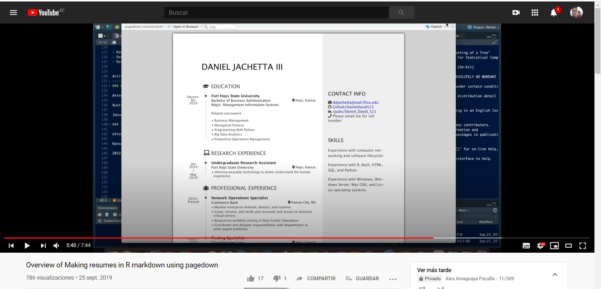
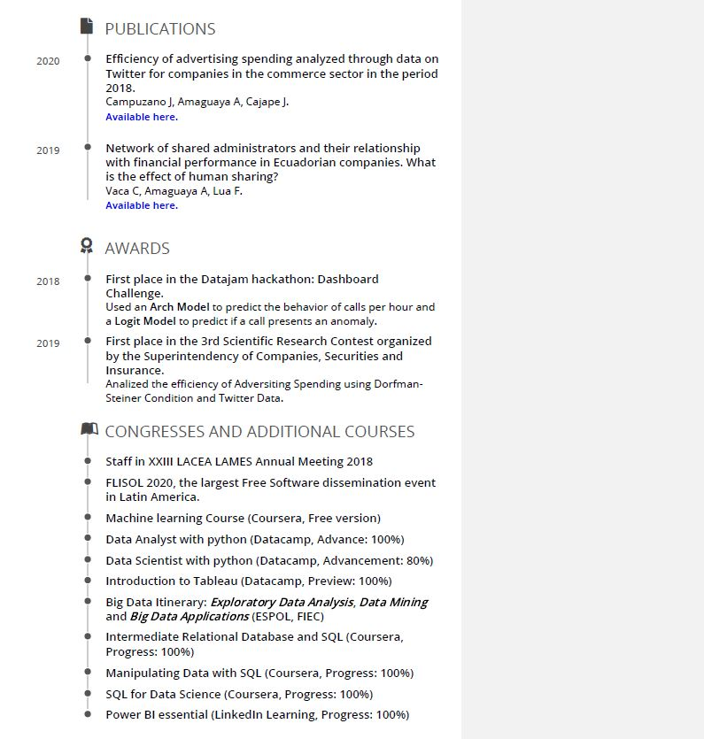

# Fast Resume 
--------------
I used pagedown in R and created my resume very quickly. This resource can be used like an initial example.

I suggest you watch this video that helped me a lot.

[**Link here.**](https://www.youtube.com/watch?v=flhl2WkJnhE&list=WL&index=11&t=337s)

This example was really interesting and you should use it.

Also, I show you how my resume looks.

